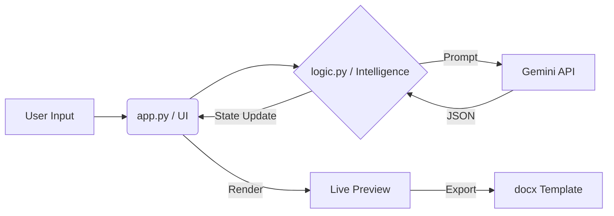

<div align="center">

# 🌱 Bean
### The Intelligent IEEE Documentation Agent

[](https://streamlit.io)
[](https://www.python.org/downloads/)
[](https://deepmind.google/technologies/gemini/)
[](https://opensource.org/licenses/MIT)

**Bean** is a "Human-in-the-Loop" AI agent designed to turn messy, unstructured notes into professionally formatted IEEE event reports. It bridges the gap between chaos and documentation.

[Features](#-key-features) • [Installation](#-installation-setup) • [Usage](#-how-to-use) • [Architecture](#-system-architecture)

</div>

---

## 🚀 The Problem & The Solution

**The Problem:** Student branches organize dozens of events, but documenting them is a chore. Details are scattered across WhatsApp chats, scratchpads, and emails. Reports are often delayed, incomplete, or poorly formatted.

**The Bean Solution:** A split-screen web interface where you talk to an AI.
1.  **You Paste:** Dump your messy notes.
2.  **Bean Extracts:** It identifies the Title, Speaker, Date, and Stats.
3.  **Bean Asks:** It notices what's missing (e.g., "What was the date?") and asks you specifically for it.
4.  **You Export:** Once the data is green and clean, you get a perfect Microsoft Word (`.docx`) report.

---

## ✨ Key Features

| Feature | Description |
| :--- | :--- |
| **🧠 Intelligent Extraction** | Uses **Google Gemini 2.5** to parse natural language and extract strict JSON data. |
| **👀 Live Preview** | See your report build in real-time. Visual indicators (🔴/✅) show exactly what's missing. |
| **💬 Co-Pilot Chat** | A conversational agent that doesn't just chat—it *interviews* you to complete the report. |
| **📄 Instant DOCX** | Uses Jinja2 templating to generate standard IEEE-formatted Word documents instantly. |
| **🛡️ Hallucination-Free** | Strictly programmed to mark unknown fields as "UNKNOWN" rather than inventing facts. |

---

## 🛠 Installation & Setup

### Prerequisites
*   Python 3.10 or higher
*   A Google Cloud API Key (for Gemini)

### 1. Clone the Repository
```bash
git clone https://github.com/yourusername/bean.git
cd bean
```

### 2. Install Dependencies
```bash
pip install -r requirements.txt
```

### 3. Configure Environment
Create a `.env` file in the root directory and add your API Key:
```bash
GEMINI_API_KEY=AIzaSyYourKeyHere...
```

### 4. Initialize Templates
Generate the base Word template (required for the first run):
```bash
python setup_template.py
```

---

## 🖥️ How to Use

1.  **Start the Agent:**
    ```bash
    streamlit run app.py
    ```
2.  **Ingest Data:** Paste your event notes (from WhatsApp, Email, etc.) into the left-hand chat window.
3.  **Refine:** Bean will analyze the text. If information is missing (like the *Speaker Name* or *Duration*), it will ask you clarifying questions.
4.  **Monitor:** Watch the "Live Preview" on the right. Red flags (🔴) will turn into Green checks (✅) as you provide details.
5.  **Download:** Once the "Completeness" bar hits 100% (or you are satisfied), the **Download Report** button will unlock.

---

## 🏗 System Architecture

Bean follows a strict Model-View-Controller (MVC) adaptation for Streamlit:



### File Structure
```text
/bean
├── 📄 app.py            # Frontend (Streamlit) - The View
├── 🧠 logic.py          # LLM Interaction & Processing - The Controller
├── 📦 models.py         # Pydantic Schemas - The Model
├── 📝 templates/        # Word Document Templates
│   └── ieee_report.docx
├── ⚙️ setup_template.py # Template Generator Script
└── 🔐 .env              # Secrets (Not committed)
```

---

## 🤝 Contributing

We welcome contributions! Please follow these steps:
1.  Fork the repository.
2.  Create a feature branch (`git checkout -b feature/AmazingFeature`).
3.  Commit your changes.
4.  Push to the branch.
5.  Open a Pull Request.

---

<div align="center">

**Built with ❤️ for IEEE RIT**
*Efficiency through Intelligence*

</div>
